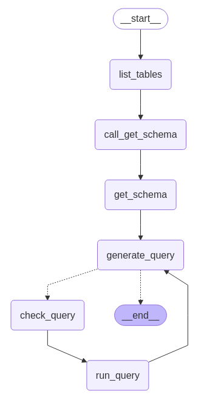

# LangGraph Agent SQL

Este projeto implementa um agente inteligente baseado em LangGraph que permite interagir com um banco de dados SQL usando linguagem natural. O agente utiliza um fluxo de trabalho estruturado para gerar, validar e executar consultas SQL de forma segura e eficiente.

## 🚀 Funcionalidades

- **Chat com banco de dados**: Converse com seus dados usando linguagem natural
- **Fluxo inteligente de consultas**: Sistema de múltiplas etapas que lista tabelas, obtém esquemas e gera consultas
- **Validação automática**: Verificação de sintaxe SQL e correção de erros comuns antes da execução
- **Memória de conversação**: Mantém contexto da conversa usando MemorySaver do LangGraph
- **Interface streaming**: Resposta em tempo real durante o processamento
- **Prompts especializados**: Prompts otimizados para geração e validação de consultas SQL
- **Dados de exemplo**: Banco de dados pré-configurado com dados de vendas e faturamento

## 🏗️ Arquitetura

O projeto utiliza LangGraph para implementar um fluxo de trabalho estruturado:

1. **List Tables**: Lista todas as tabelas disponíveis no banco
2. **Get Schema**: Obtém o esquema das tabelas relevantes
3. **Generate Query**: Gera consulta SQL baseada na pergunta do usuário
4. **Check Query**: Valida e corrige a consulta gerada
5. **Run Query**: Executa a consulta e retorna os resultados

## 📁 Estrutura do Projeto

```
langGraph-agent-SQL/
├── app.py                              # Aplicação principal com interface CLI
├── requirements.txt                    # Dependências do projeto
├── graph_agents/
│   ├── agent_sql.py                   # Configuração e inicialização do agente
│   └── graph_sql.py                   # Definição do grafo LangGraph
├── database/
│   ├── costumer-database.db           # Banco de dados SQLite
│   ├── create_table.sql               # Script de criação de tabelas
│   └── faturamento_vendas_insert.sql  # Script com dados de exemplo
├── infra/
│   └── llm.py                         # Configuração do modelo de linguagem
├── prompt/
│   ├── generate_query_system_prompt.txt  # Prompt para geração de consultas
│   └── check_query_system_prompt.txt     # Prompt para validação de consultas
└── tool/
    └── sql_tool.py                    # Ferramentas SQL usando LangChain Community
```

## 🛠️ Tecnologias Utilizadas

- **LangGraph**: Framework para construção de aplicações de IA com fluxos estruturados
- **LangChain**: Biblioteca para integração com modelos de linguagem
- **OpenAI GPT-4o-mini**: Modelo de linguagem para geração e validação de consultas
- **SQLite**: Banco de dados leve e eficiente
- **Python**: Linguagem de programação principal
- **python-dotenv**: Gerenciamento de variáveis de ambiente

## 🛠️ Pré-requisitos

### 1. Instalar SQLite

**macOS:**
```bash
brew install sqlite
```

**Linux (Ubuntu/Debian):**
```bash
sudo apt-get update
sudo apt-get install sqlite3
```

**Windows:**
- Baixe o SQLite Tools do [site oficial](https://www.sqlite.org/download.html)
- Extraia os arquivos em uma pasta e adicione ao PATH

### 2. Extensões do VS Code (Recomendadas)

Instale as seguintes extensões no VS Code para melhor experiência:

- **SQLite Viewer** (`qwtel.sqlite-viewer`)
- **SQLite** (`alexcvzz.vscode-sqlite`)

### 3. Criar chave OpenAI API

1. Acesse [OpenAI Platform](https://platform.openai.com/)
2. Crie uma conta ou faça login
3. Vá para [API Keys](https://platform.openai.com/api-keys)
4. Clique em "Create new secret key"
5. Copie a chave gerada

## ⚙️ Configuração

### 1. Clone o repositório

```bash
git clone <url-do-repositorio>
cd langGraph-agent-SQL
```

### 2. Criar ambiente virtual

```bash
python -m venv env
source env/bin/activate  # macOS/Linux
# ou
env\Scripts\activate     # Windows
```

### 3. Instalar dependências

```bash
pip install -r requirements.txt
```
### 4. Criar e popular o banco de dados

```bash
# Criar o banco de dados
sqlite3 database/costumer-database.db < database/create_table.sql

# Inserir dados de exemplo
sqlite3 database/costumer-database.db < database/faturamento_vendas_insert.sql
```

### 5. Configurar variáveis de ambiente

Crie um arquivo `.env` na raiz do projeto:

```bash
touch .env
```

Adicione as seguintes variáveis ao arquivo `.env`:

```env
# Chave da API OpenAI
OPENAI_API_KEY=sua_chave_da_openai_aqui

# Caminho para o banco de dados SQLite
DATABASE_SQLITE_PATH=path_do_banco_criado_executar_os_comandos_sql
```

## 🚀 Como usar

### 1. Executar a aplicação

```bash
python app.py
```

### 2. Interagir com o agente

Digite suas perguntas em linguagem natural sobre os dados. Exemplos:

```
User: Qual foi o faturamento total por mês?
User: Mostre os 5 produtos mais vendidos
User: Qual cliente teve o maior valor de compra?
```

### 3. Monitorar o fluxo

O agente seguirá automaticamente este fluxo:
1. Lista as tabelas disponíveis
2. Obtém o esquema das tabelas relevantes
3. Gera uma consulta SQL
4. Valida e corrige a consulta se necessário
5. Executa a consulta e apresenta os resultados



### 4. Sair da aplicação

Digite `exit` ou `quit` para encerrar o chat.

## 🤝 Contribuição

1. Faça um fork do projeto
2. Crie uma branch para sua feature (`git checkout -b feature/nova-feature`)
3. Commit suas mudanças (`git commit -am 'Adiciona nova feature'`)
4. Push para a branch (`git push origin feature/nova-feature`)
5. Abra um Pull Request

## 📝 Changelog

### v2.0.0 - Atual
- ✅ Migração para arquitetura LangGraph mais robusta
- ✅ Implementação de fluxo estruturado de consultas
- ✅ Sistema de validação de consultas SQL
- ✅ Memória de conversação com MemorySaver
- ✅ Prompts especializados para cada etapa
- ✅ Interface streaming para respostas em tempo real
- ✅ Reorganização da estrutura de pastas

### v1.0.0 - Anterior
- ✅ Implementação básica do agente LangGraph SQL
- ✅ Integração com OpenAI
- ✅ Interface CLI simples

## 📄 Licença

Este projeto está sob a licença MIT. Veja o arquivo [LICENSE](LICENSE) para mais detalhes.